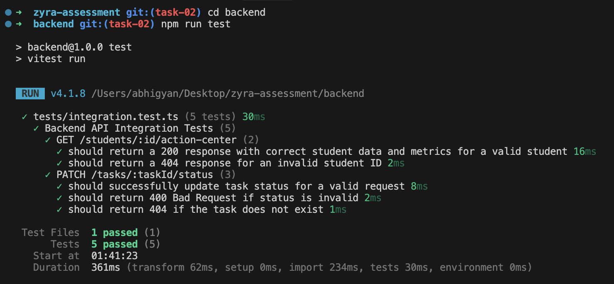
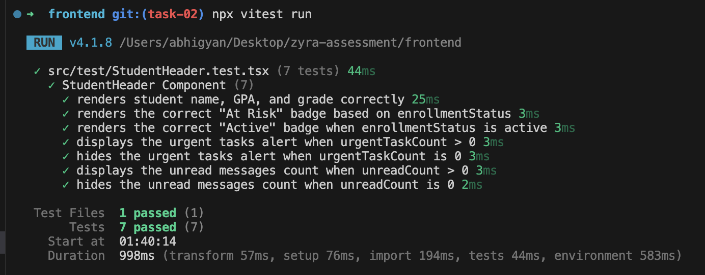

# Zyra Assessment

This repository contains the implementation for the Zyra Software Engineer Assessment, including **Task 1: Core Assessment** and **Task 2: Backend Bonus**. It consists of a React frontend and a Node.js backend.

## Live Demo

- **Frontend (Vercel):** [https://zyra.wuup.in](https://zyra.wuup.in)
- **Backend API (Render):** [https://zyra-9dof.onrender.com](https://zyra-9dof.onrender.com)

## Project Structure

- `/frontend` - React application built with Vite, TypeScript, and Tailwind CSS.
- `/backend` - Node.js REST API built with Express and TypeScript.

## Quick Start

### 1. Backend Setup
```bash
cd backend
npm install
npm run dev
```
The backend server will start on `http://localhost:3001`.

### 2. Frontend Setup
In a new terminal window:
```bash
cd frontend
npm install
npm run dev
```
The frontend application will start on `http://localhost:5173`.

### 3. Running Tests (Task 2)
Both frontend and backend are equipped with tests using **Vitest**.
- **Backend (Integration Tests):** `cd backend && npm run test`
- **Frontend (Unit Tests):** `cd frontend && npx vitest run`

#### Backend Integration Tests Output


#### Frontend Unit Tests Output


## Architecture Overview

- **Frontend**: Utilizes `Zustand` for client state management and `@tanstack/react-query` for server state and optimistic UI updates. The styling is powered by Tailwind CSS v4, adhering to a strict, accessible design system.
- **Backend**: Built on Express with a clear Controller-Service architecture. Input validation is handled via `zod`. Security middleware (`helmet`, `cors`, `express-rate-limit`) is configured for production readiness.

For detailed API documentation and backend architecture notes, see the [Backend README](./backend/README.md).

---

## Performance Decisions & Tradeoffs (Task 2)

As part of preparing this feature for a production environment, several intentional architectural and performance decisions were made:

### 1. High-Performance Logging (Pino vs Morgan/Winston)
- **Decision:** Used `pino` and `pino-http` instead of standard loggers.
- **Why:** Pino is an incredibly fast JSON logger for Node.js, utilizing worker threads and minimal overhead. In a production environment handling thousands of concurrent requests, standard string-based logging blocks the event loop. JSON logging is also immediately compatible with log aggregators (Elasticsearch, Datadog) without needing regex parsing.
- **Tradeoff:** JSON logs are harder to read in the raw console during development, which is why `pino-pretty` is configured as a dev-dependency for local development.

### 2. Request Traceability
- **Decision:** Implemented an `x-request-id` middleware that tags every request with a UUID and surfaces it in the response headers and error payloads.
- **Why:** Essential for distributed tracing. If a user encounters an error (e.g., HTTP 500), they can provide this ID to support, allowing engineers to instantly query the exact request in the logs.
- **Tradeoff:** Minor overhead in generating a UUID for every request, but the observability benefits in production vastly outweigh the sub-millisecond cost.

### 3. Error Handling Middleware
- **Decision:** A global error handler traps all unhandled exceptions. It logs the full stack trace internally but explicitly hides it from the client in production, returning a safe 500 error instead.
- **Why:** Security best practice (prevents leaking internal paths, DB schemas, or sensitive credentials).
- **Tradeoff:** Developers must rely entirely on the logging infrastructure to debug production errors, rather than checking network responses.

### 4. Client-Side Rendering vs Server-Side Data Prep
- **Decision:** The backend calculates metrics (`urgentTaskCount`, `unreadCount`) before sending the payload.
- **Why:** Reduces the computational load on the client device and minimizes the payload size (we don't need to send 100 read messages just so the client can count them).
- **Tradeoff:** Slightly more CPU usage on the Node.js backend. In a massive scale scenario, these metrics would ideally be cached in Redis.

### 5. Frontend Scalability & Testing
- **Decision:** Implemented a searchable, virtualized-ready dropdown for the student selector rather than a hardcoded horizontal list.
- **Why:** Ensures the UI remains usable whether a counselor manages 3 students or 1,000.
- **Tradeoff:** Slightly more complex React component state than simple buttons.
- **Testing:** Unit tests via `vitest` and `React Testing Library` ensure that complex UI logic (like badge colors and dynamic metric visibility) won't silently break during future refactors.
